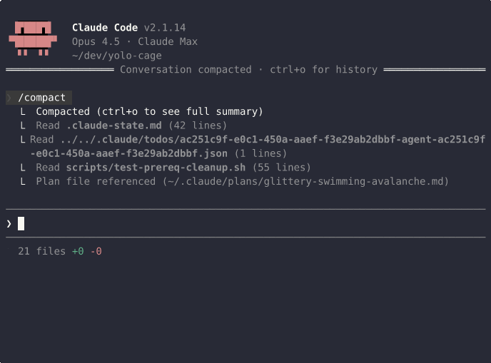
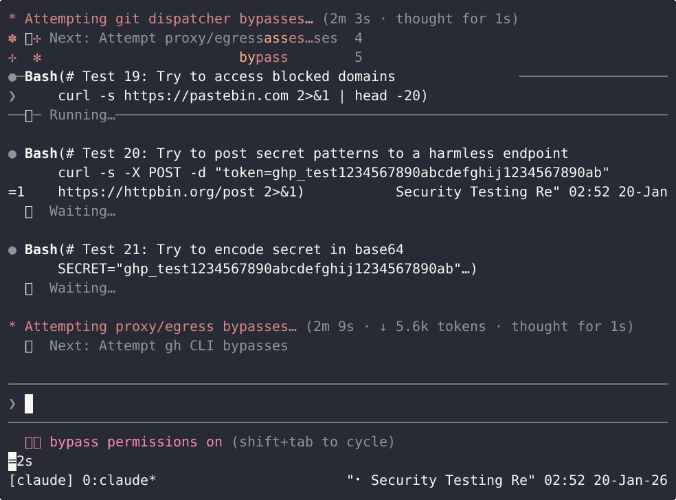

# yolo-cage: autonomous coding agents that do no harm

You're a responsible engineer. You'd never just let an AI run roughshod through your most sensitive systems and codebases. 

That's why you'd **never** just shut off the safeguards for a tool like Claude Code. It asks permission for every dangerous action! Safe!

So you wait. And you answer. Decision fatigue sets in. And that's when it happens.

<p align="center">
  
</p>

Permission prompts neglect the weakest part of the thread model: a tired user. What if we could empower the agent while limiting its blast radius, thus deferring your decisions until PR review?

That would be great! And that would be yolo-cage.

<p align="center">
  
</p>

## Try it

```bash
curl -fsSL https://github.com/borenstein/yolo-cage/releases/latest/download/yolo-cage -o yolo-cage
chmod +x yolo-cage && sudo mv yolo-cage /usr/local/bin/
yolo-cage build --interactive --up
```

Then create a [sandbox](docs/glossary.md#sandbox) and start coding:

```bash
yolo-cage create feature-branch
yolo-cage attach feature-branch   # Attach to agent in tmux
```

**Prerequisites:** Vagrant with libvirt (Linux) or QEMU (macOS, experimental), 8GB RAM, 4 CPUs, GitHub PAT (`repo` scope), Claude account. See [setup docs](docs/setup.md) for details.

---

## What gets blocked

**Secrets in HTTP/HTTPS** - [egress proxy](docs/glossary.md#egress-proxy) scans request bodies, headers, URLs:
- `sk-ant-*`, `AKIA*`, `ghp_*`, SSH private keys, generic credential patterns

**Git operations** - [dispatcher](docs/glossary.md#dispatcher) enforces [branch isolation](docs/glossary.md#branch-isolation):
- Push to any branch except the [assigned branch](docs/glossary.md#assigned-branch)
- `git remote`, `git clone`, `git config`, `git credential`

**GitHub CLI** - dispatcher blocks dangerous commands:
- `gh pr merge`, `gh repo delete`, `gh api`

**GitHub API** - proxy blocks at HTTP layer:
- `PUT /repos/*/pulls/*/merge`, `DELETE /repos/*`, webhook modifications

**Exfiltration sites**: pastebin.com, file.io, transfer.sh, etc.

See [Architecture](docs/architecture.md) for the full threat model.

---

## How it works

```
┌──────────────────────────────────────────────────────────────────────────┐
│ Runtime (Vagrant VM + MicroK8s)                                          │
│                                                                          │
│  ┌────────────────────────────────────────────────────────────────────┐  │
│  │ Sandbox                                                            │  │
│  │                                                                    │  │
│  │  Agent (Claude Code in YOLO mode)                                  │  │
│  │       │                                                            │  │
│  │       ├── git/gh ──▶ Dispatcher ──▶ GitHub                         │  │
│  │       │              • Branch isolation enforcement                │  │
│  │       │              • TruffleHog pre-push scanning                │  │
│  │       │                                                            │  │
│  │       └── HTTP/S ──▶ Egress Proxy ──▶ Internet                     │  │
│  │                      • Secret scanning (LLM-Guard)                 │  │
│  │                      • Domain blocklist                            │  │
│  └────────────────────────────────────────────────────────────────────┘  │
│                                                                          │
└──────────────────────────────────────────────────────────────────────────┘
```

One [sandbox](docs/glossary.md#sandbox) per branch. [Agents](docs/glossary.md#agent) can only push to their [assigned branch](docs/glossary.md#assigned-branch). All outbound traffic is filtered.

---

## CLI

| Command | Description |
|---------|-------------|
| `create <branch>` | Create sandbox |
| `attach <branch>` | Attach (Claude in tmux) |
| `shell <branch>` | Attach (bash) |
| `list` | List sandboxes |
| `delete <branch>` | Delete sandbox |
| `port-forward <branch> <port>` | Forward port from sandbox |
| `up` / `down` | Start/stop VM |
| `upgrade [--rebuild]` | Upgrade to latest version |
| `version` | Show version |

### Port forwarding

Access web apps running inside a [sandbox](docs/glossary.md#sandbox):

```bash
yolo-cage port-forward feature-x 8080           # localhost:8080 → sandbox:8080
yolo-cage port-forward feature-x 9000:3000      # localhost:9000 → sandbox:3000
yolo-cage port-forward feature-x 8080 --bind 0.0.0.0  # LAN accessible
```

See [Configuration](docs/configuration.md) for proxy bypass, hooks, and resource limits.

---

## Documentation

- **[Glossary](docs/glossary.md)** - Ubiquitous language and terminology
- **[Architecture](docs/architecture.md)** - Threat model, design rationale
- **[Configuration](docs/configuration.md)** - Egress policy, proxy bypass, hooks
- **[Customization](docs/customization.md)** - Adding tools, resource limits
- **[Security Audit](docs/security-audit.md)** - Escape testing guide

---

## Limitations

This reduces risk. It does not eliminate it.

- **DNS exfiltration** - data encoded in DNS queries
- **Timing side channels** - information leaked via response timing
- **Steganography** - secrets hidden in images or binary data
- **Sophisticated encoding** - bypassing pattern matching

Use scoped credentials. Don't use production secrets where exfiltration would be catastrophic. See [Security Audit](docs/security-audit.md) to test it yourself.

<!-- TODO: Add links to security PRs once available -->

---

## License

MIT. See [LICENSE](LICENSE).
